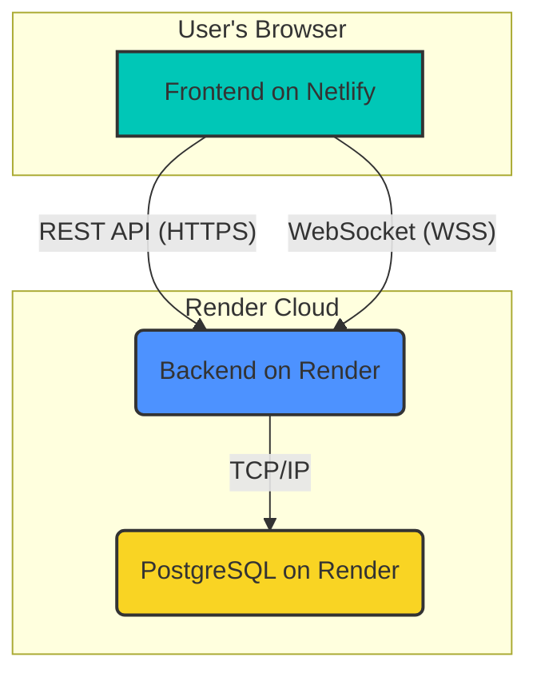

# Sports Tournament Manager Application Documentation

This document provides a comprehensive overview of the Sports Tournament Manager application, covering its architecture, features, and deployment process.

## 1. Introduction

The Sports Tournament Manager is a full-stack web application designed to facilitate the organization, management, and real-time tracking of sports tournaments. It supports various user roles (Admin, Manager) with distinct functionalities, including tournament setup, team and player management, automated match scheduling, live score updates, and real-time notifications to all viewers.

## 2. System Architecture

The application is built on a modern, decoupled architecture that separates the frontend, backend, and database into distinct, independently deployable services. This design enhances scalability, maintainability, and performance.

### 2.1 Components

-   **Frontend (Client)**: A single-page application (SPA) built with **React** (using Vite) and **TypeScript**. It provides a dynamic, interactive user interface for all users.
-   **Backend (Server)**: A monolithic API server developed with **NestJS** and **TypeScript**. It exposes RESTful APIs, handles all business logic, manages user authentication, and provides real-time updates via WebSockets.
-   **Database**: A **PostgreSQL** database that serves as the primary, persistent data store for the application.

### 2.2 Hosting Environment

-   **Frontend (Netlify)**: The React frontend is deployed on **Netlify**. This provides:
    -   **Global CDN**: For fast delivery of static assets (HTML, CSS, JavaScript) to users worldwide.
    -   **Continuous Deployment**: Automatically deploys new versions of the frontend when changes are pushed to the `production` branch on GitHub.
    -   **Environment Management**: Manages the `VITE_API_URL` environment variable, which tells the frontend how to communicate with the backend.
-   **Backend & Database (Render)**: The backend server and database are both hosted on **Render**.
    -   **Backend (Web Service)**: The NestJS application is deployed as a Render Web Service. It automatically restarts on failure and can be scaled as needed.
    -   **Database (Managed PostgreSQL)**: Render provides a fully managed PostgreSQL instance, handling backups, security, and maintenance. The backend connects to the database via an internal, secure connection string (`DATABASE_URL`).

## 3. Communication Flow

The components of the system communicate through two primary channels: REST API (for standard data requests) and WebSockets (for real-time updates).

### 3.1 REST API Communication (Request-Response)

The frontend communicates with the backend via standard HTTPS requests. This is used for actions like fetching data, logging in, or submitting changes.

**Example Flow: Admin Updates a Match Score**

1.  **User Action**: The Admin enters a new score on the "Live Score Input" page in the frontend application.
2.  **API Request**: The frontend sends a `PUT` request to the backend API endpoint, for example: `PUT /api/matches/:matchId/score`. The request body contains the new score, and the `Authorization` header contains the Admin's JWT.
3.  **Backend Processing**:
    -   The NestJS backend receives the request.
    -   The `JwtAuthGuard` and `RolesGuard` verify that the user is an authenticated Admin.
    -   The `MatchesService` updates the match score in the PostgreSQL database via TypeORM.
    -   The `StandingsService` is triggered to recalculate and update the points and goal difference for the involved teams.
4.  **API Response**: The backend sends a success response (e.g., `200 OK`) back to the frontend, confirming that the score was updated.

### 3.2 WebSocket Communication (Real-time)

For instant updates across all users' screens, the application uses WebSockets.

**Example Flow: Broadcasting the Score Update**

1.  **Backend Broadcast**: Immediately after updating the score in the database, the `MatchesService` calls the `RealtimeGateway`.
2.  **WebSocket Event**: The `RealtimeGateway` emits a `tournament_updated` event to all connected clients in the specific tournament's "room". The event payload contains the entire, fresh `tournament` object, including the updated match and team standings.
3.  **Frontend Update**:
    -   Every connected client (admins, managers, public viewers) receives the `tournament_updated` event.
    -   The `useTournament` hook in the React frontend updates its global state with the new tournament data.
    -   React automatically re-renders all components that depend on this data (e.g., the `Standings` table, the `Fixtures` list), so every user sees the new score and updated standings instantly, without needing to refresh their page.

## 4. Core Features and API

The application's functionality is exposed through a set of RESTful API endpoints, which are consumed by the frontend.

### 4.1 User Authentication

-   **`POST /login`**: Authenticates a user (Admin or Manager) and returns a JWT `access_token` and user details. This is the entry point for all protected actions.

### 4.2 Tournament Management

-   **`GET /api/tournaments/:id`**: Retrieves all data for a single tournament. This is the main data-loading endpoint for the frontend.
-   **`PUT /api/tournaments/:id`**: Allows an Admin to update core tournament details like name, format, and status (`draft`, `live`, `completed`).

### 4.3 Team & Player Management

-   **`POST /api/tournaments/:id/teams`**: Allows an Admin or Manager to create a new team and its associated manager user.
-   **`PUT /api/tournaments/:id/teams/:teamId`**: Updates a team's (and its manager's) details.
-   **`DELETE /api/tournaments/:id/teams/:teamId`**: Deletes a team.
-   **`POST`, `PUT`, `DELETE` on `/players` sub-routes**: Allows Admins and Managers to add, update, and remove players from their teams.

### 4.4 Schedule & Score Management

-   **`POST /api/tournaments/:id/schedule/generate`**: (Admin-only) Automatically generates a round-robin schedule for all teams in the tournament.
-   **`PUT /api/matches/:matchId/score`**: (Admin-only) Updates the score of a match. This is a critical endpoint that also triggers the automatic recalculation of team standings.

### 4.5 Real-time Notifications

-   **`POST /api/tournaments/:id/notifications`**: (Admin-only) Creates a new notification. When called, the backend also broadcasts a `notification_sent` WebSocket event to all users, allowing for real-time alerts.
-   **`DELETE /api/tournaments/:id/notifications/:notificationId`**: (Admin-only) Deletes a notification. When called, the backend broadcasts a `tournament_updated` WebSocket event to all users, ensuring the deleted notification is removed from everyone's view in real-time.

## 5. Deployment Guide

This application is designed for a simple and modern continuous deployment workflow using Render and Netlify.

### 5.1 Prerequisites

-   A GitHub account with the project repository pushed.
-   A Render account.
-   A Netlify account.

### 5.2 Part 1: Deploying the Backend on Render

1.  **Create the Database:**
    -   On the Render dashboard, create a new **PostgreSQL** database.
    -   Once created, copy the **Internal Database URL**.

2.  **Create the Web Service:**
    -   On the Render dashboard, create a new **Web Service**.
    -   Connect it to your GitHub repository.
    -   **Configuration:**
        -   **Build Command:** `npm install && npm run build`
        -   **Start Command:** `npm run start:prod`
        -   **Environment Variables:**
            -   `DATABASE_URL`: Paste the Internal Database URL from the previous step.
            -   `JWT_SECRET`: Provide a strong, randomly generated string.

3.  **Deploy:**
    -   Finish the setup. Render will automatically deploy the service. Upon the first deployment, the `seedDatabase` function will run, populating the database with a default tournament and users.
    -   Once live, copy the public URL of your service (e.g., `https://your-app.onrender.com`).

### 5.3 Part 2: Deploying the Frontend on Netlify

There are two methods: Git-based deployment (recommended) or manual deployment.

**Method A: Git-Based Deployment (Recommended)**

1.  **Create a New Site:**
    -   On Netlify, create a new site by importing an existing project from GitHub.
    -   Select your repository.

2.  **Configure Build Settings:**
    -   **Branch to deploy:** `production` (or your main branch).
    -   **Build command:** `npm install && npm run build`
    -   **Publish directory:** `build` (as configured in `vite.config.ts`).
    -   **Environment Variable:**
        -   **Key:** `VITE_API_URL`
        -   **Value:** `https://<your-render-url>/api`

3.  **Deploy:**
    -   Click "Deploy site". Netlify will build and deploy the frontend. Any future push to the `production` branch will trigger an automatic redeployment.

**Method B: Manual Deployment**

1.  **Create `.env.production` file:**
    -   In your local project root, create a file named `.env.production`.
    -   Add one line: VITE_API_URL=https://cp2-unfv.onrender.com/api

2.  **Build Locally:**
    -   Run `npm install && npm run build` in your terminal. This will create a `build` folder.

3.  **Upload to Netlify:**
    -   On the Netlify "Sites" page, find the drag-and-drop area.
    -   Drag your local `build` folder and drop it there.

### 5.4 Default Login Credentials

After deployment and database seeding, you can use the following default accounts:

-   **Admin Account**
    -   **Email:** `admin@tournament.my`
    -   **Password:** `admin123`
-   **Manager Account**
    -   **Email:** `ahmad@fcpj.my`
    -   **Password:** `manager123`